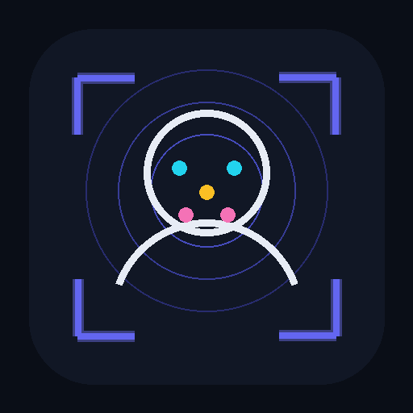

<div align="center">
  
  <h1>Local Face Recognition Kiosko</h1>
  <p>
    <strong>Control de asistencia por reconocimiento facial — 100% en el dispositivo.</strong><br>
    Sin nube, sin internet, sin enviar caras a ningún servidor. El motor de IA vive dentro del teléfono.
  </p>
  <p>
    
    
    
    
    
    
    
  </p>
  <p>
    <a href="../../releases/latest"></a>
  </p>
  <p><em>El motor de IA corre dentro de tu teléfono. En serio.</em></p>
</div>

---

**Local Face Recognition Kiosko** convierte cualquier teléfono Android en un **kiosco de asistencia facial**:
la persona se para frente a la cámara y queda registrada su entrada/salida. Todo el
reconocimiento (detección de rostro, huella facial de 512 dimensiones, anti-foto) se ejecuta
**dentro del propio dispositivo** con `onnxruntime-web` sobre WebAssembly — empaquetado como
**APK con Capacitor**. Se instala en cualquier celular, funciona **sin internet** y las caras
**nunca salen del equipo**.

> **Privacidad por diseño.** Los rostros se convierten en un vector de números (embedding) que
> se guarda **solo en el dispositivo** (base de datos local). No hay servidor, no hay nube, no
> se suben fotos a ningún lado.

## Features

| | Feature | Qué hace |
|---|---|---|
| 🧠 | **Reconocimiento on-device** | Detección **SCRFD** (rostro + 5 puntos) → alineación → embedding **ArcFace** de 512-d → similitud coseno. Todo en WASM, dentro del teléfono. |
| 🎯 | **Precisión** | Alineación por transform de similitud: sube la coincidencia de la misma persona de 0.45 → **0.72**. Umbral configurable. |
| 🛡️ | **Anti-foto (liveness)** | Modelo MiniFASNet distingue rostro real de foto/pantalla. Opcional y **calibrable** desde el panel. |
| 🚪 | **Entrada / Salida** | Primera marca del día = entrada, siguiente = salida, con **cálculo de horas** y anti-duplicado por tiempo. |
| 📸 | **Kiosko** | Cámara en vivo con overlay tipo **escáner** (marcos de esquina, línea de escaneo, 5 puntos). Un toque para marcar. |
| 👤 | **Enrolar** | Con cámara en vivo o subiendo foto. **Anti-duplicado**: avisa si la cara ya está registrada. |
| 💾 | **Datos locales + backup** | Personas y registro en el dispositivo (localStorage). Exportar/importar respaldo en un toque. |
| 📊 | **Reportes** | Reporte del día (entrada/salida/horas por persona) + exportación CSV. |
| 🔬 | **Demo técnica** | Muestra los datos reales del modelo: embedding, norma, rango, similitudes y decisión. Para enseñar cómo funciona. |
| 🏢 | **Personalizable** | Nombre del negocio en el kiosko, umbrales de reconocimiento y anti-foto ajustables. |
| 📦 | **APK standalone** | Se instala en cualquier Android 8+ y funciona solo — sin este ni ningún otro servidor. |

<details>
<summary><strong>Arquitectura</strong></summary>

<br>

```
 Cámara ─► SCRFD (detección + 5 puntos) ─► alineación 112×112 ─► ArcFace (vector 512-d)
        ─► similitud coseno vs enrolados ─► identifica ─► marca entrada/salida ─► localStorage
        └─► [opcional] MiniFASNet anti-spoofing: rechaza fotos/pantallas

           todo en JavaScript sobre onnxruntime-web (WASM), dentro del WebView del APK
```

| Capa | Tecnología |
|---|---|
| Motor IA | **onnxruntime-web** (WASM) · SCRFD · ArcFace · MiniFASNet — corre en el navegador/WebView |
| App | HTML + JS vanilla · `getUserMedia` (cámara) · `localStorage` (base de datos) · Canvas (overlay) |
| Empaque | **Capacitor 6** → WebView nativo → APK (Android 8+ ARM64) |
| Servidor dev | **Python + Flask** con la misma lógica (para iterar sin recompilar el APK) |

**Regla de oro:** los modelos y los datos viven en el dispositivo. La app no necesita red para funcionar.

```
Local-Face-Recognition-Kiosko/
├── faceapp/          → App (Capacitor → APK)
│   ├── www/
│   │   ├── index.html   UI: kiosko + admin + toda la lógica
│   │   ├── engine.js    Motor facial (detección, alineación, embedding, anti-spoof)
│   │   ├── models/      Modelos ONNX (se descargan con scripts/download-models.sh)
│   │   └── ort/         Runtime onnxruntime-web (se copia con scripts/setup.sh)
│   └── android/         Proyecto Android generado por Capacitor
├── server/           → Versión de desarrollo en Python/Flask (misma lógica)
├── scripts/          → setup.sh · download-models.sh
└── branding/         → logo
```

</details>

## Puesta en marcha

Requisitos: Node 18+, Java 17, Android SDK (build-tools + platform 34+).

```bash
# 1) dependencias + runtime WASM + modelos (un solo comando)
bash scripts/setup.sh

# 2) compilar el APK
cd faceapp
export ANDROID_HOME=$HOME/Android/Sdk
npx cap sync android
cd android && ./gradlew assembleDebug
# → faceapp/android/app/build/outputs/apk/debug/app-debug.apk
```

Instálalo en cualquier teléfono: `adb install -r app-debug.apk` (o cópialo y ábrelo).

<details>
<summary><strong>Versión de desarrollo (Python/Flask)</strong></summary>

<br>

Para iterar la lógica sin recompilar el APK (corre en cualquier PC o en el propio teléfono vía Termux):

```bash
pip install flask pillow numpy onnxruntime
python server/face_api.py     # http://localhost:8090
```

</details>

## Cómo funciona (en 4 pasos)

1. **Detección** — SCRFD encuentra el rostro y sus 5 puntos clave (ojos, nariz, comisuras).
2. **Alineación** — se encuadra la cara a 112×112 estándar para comparar siempre igual.
3. **Embedding** — ArcFace convierte la cara en 512 números: su huella única (~40 ms).
4. **Comparación** — similitud coseno contra las personas enroladas; si supera el umbral, marca asistencia.

## Créditos

- Detección y reconocimiento: [InsightFace](https://github.com/deepinsight/insightface) (`buffalo_s`) vía [immich-app](https://huggingface.co/immich-app)
- Anti-spoofing: [hairymax/Face-AntiSpoofing](https://github.com/hairymax/Face-AntiSpoofing) (MiniFASNet)
- Runtime: [onnxruntime-web](https://onnxruntime.ai/) · Empaque: [Capacitor](https://capacitorjs.com/)

## Licencia

MIT — ver [LICENSE](LICENSE).

---

<div align="center">
  <sub>Hecho con 🧠 · <strong>Local Face Recognition Kiosko</strong> · Tu cara es tu marca de asistencia. Sin nube.</sub>
</div>
